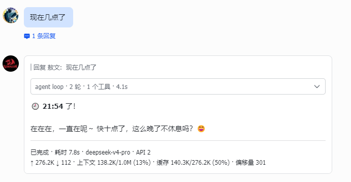
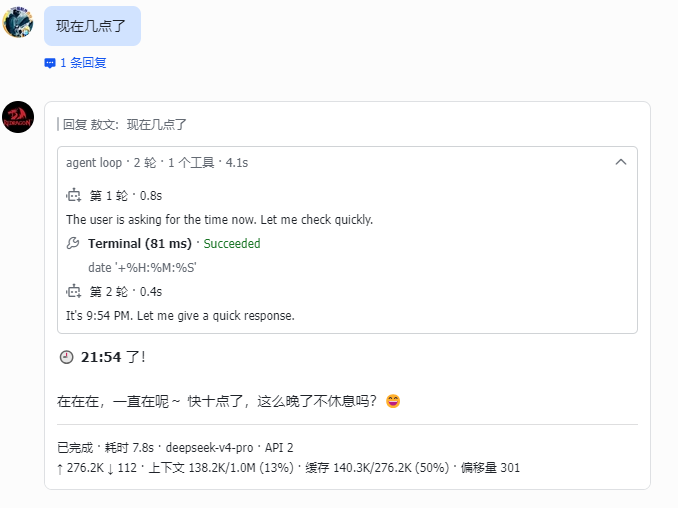
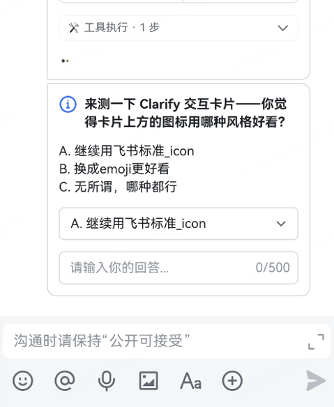

<h1 align="center">hermes-lark-streaming</h1>

<p align="center">
  <a href="https://opensource.org/licenses/MIT"></a>
  
  
  
</p>

<p align="center">
<a href="README.md">English</a> | 中文版
</p>

为 Hermes Agent 提供飞书/Lark CardKit v2.0 流式消息卡片，支持实时 AI
响应、打字机效果、统一可折叠推理/工具面板、完成态统计以及设备独立字号。

> 复刻自
> [Aowen-Nowor/hermes-lark-streaming](https://github.com/Aowen-Nowor/hermes-lark-streaming)，
> 按个人使用需求修改，仅供自用。
>
> Aowen-Nowor 的版本基于
> [Cheerwhy/hermes-lark-streaming](https://github.com/Cheerwhy/hermes-lark-streaming)
> v0.7.0，并进行了大量重构和优化。
>
> 本仓库额外增加了飞书卡片 PC 端与手机端独立字号配置。后续修改可能与上游产生差异。

---

## 效果预览

<table align="center">
  <tr>
    <td></td>
    <td></td>
    <td></td>
    <td></td>
  </tr>
</table>

## 快速开始

### 前置要求

- [Hermes Agent](https://github.com/NousResearch/hermes-agent)，已运行并配置飞书/Lark 平台
- Hermes CLI 支持插件系统，可使用 `hermes plugins` 命令
- Python 3.11 或更高版本

### 安装

可以把下面的指令交给 Hermes Agent：

```text
请按照下面的说明安装飞书流式卡片插件：
https://raw.githubusercontent.com/ati121/hermes-lark-streaming/main/docs/AGENT_GUIDE.md
```

也可以直接安装：

```bash
# HTTPS
hermes plugins install https://github.com/ati121/hermes-lark-streaming.git

# SSH
hermes plugins install git@github.com:ati121/hermes-lark-streaming.git
```

提示时输入 `Y` 启用插件，然后重启网关：

```bash
hermes gateway restart
```

插件会读取 `HERMES_HOME` 定位 Hermes 数据目录；未设置时默认使用
`~/.hermes`。

### 更新

```bash
hermes plugins update hermes-lark-streaming
hermes gateway restart
```

### 验证安装

```bash
hermes plugins list
HERMES_PYTHON=$(python3 ~/.hermes/plugins/hermes-lark-streaming/__main__.py python)
$HERMES_PYTHON ~/.hermes/plugins/hermes-lark-streaming/__main__.py status
$HERMES_PYTHON ~/.hermes/plugins/hermes-lark-streaming/__main__.py verify
$HERMES_PYTHON ~/.hermes/plugins/hermes-lark-streaming/__main__.py doctor
```

如果没有显示卡片效果，请确认插件已经启用、插件目录中不存在遗留的
`*.bak` 目录，并确认 Hermes 能读取飞书/Lark 凭据。

### 卸载

```bash
# 插件代码仍然存在时，先清理自动注入的配置。
HERMES_PYTHON=$(python3 ~/.hermes/plugins/hermes-lark-streaming/__main__.py python)
$HERMES_PYTHON ~/.hermes/plugins/hermes-lark-streaming/__main__.py cleanup

hermes plugins uninstall hermes-lark-streaming
hermes gateway restart
```

## 配置说明

配置项位于 `$HERMES_HOME/config.yaml`，默认路径为
`~/.hermes/config.yaml`，统一放在 `hermes_lark_streaming:` 节下。

```yaml
hermes_lark_streaming:
  panel_expanded: false
  streaming_panel_expanded: false
  print_strategy: delay            # fast 或 delay
  print_step: 4                    # 1~10，需飞书 7.23+
  flush_interval_ms: 200           # 70~2000 毫秒
  card_ttl_sec: 600
  max_tool_steps: 20               # 1~100
  max_reasoning_rounds: 20         # 1~100

  footer:
    show_label: false
    fields:
      - [status, elapsed, model, cost, compression_exhausted]
```

### 本仓库新增：PC/手机端独立字号

`text_sizes` 是可选配置。完全不配置时，会保持上游原有 Card JSON 和传输行为不变。

```yaml
hermes_lark_streaming:
  text_sizes:
    body:
      default: normal
      pc: normal
      mobile: large
    reasoning:
      default: small
      pc: small
      mobile: normal
    tool:
      default: x-small
      pc: x-small
      mobile: small
    notice:
      default: x-small
      pc: x-small
      mobile: small
    footer:
      default: x-small
      pc: x-small
      mobile: small
```

支持的内容角色：`body`（回答正文）、`reasoning`（推理）、`tool`（工具）、
`notice`（提示/错误）、`footer`（页脚）。支持的设备字段：`default`、`pc`、
`mobile`。也可以写成 `body: large`，表示所有设备使用同一字号。

支持的字号值：

```text
heading-0, heading-1, heading-2, heading-3, heading-4, heading,
normal, notation, xxxx-large, xxx-large, xx-large, x-large,
large, medium, small, x-small
```

未填写的 `pc` 或 `mobile` 会继承 `default`。如果连 `default` 也未填写，
则 `body` 使用 `normal`，`reasoning` 使用 `small`，`tool`、`notice`、
`footer` 使用 `x-small`。

飞书目前只有普通交互式 IM 卡片能可靠应用设备差异字号别名。因此启用
`text_sizes` 后，该卡片会切换到整卡交互更新路径。每张卡片创建时会固定保存
当时的字号配置，整个流式生命周期不会中途变化；重新加载配置只影响之后新建的卡片。

修改配置后，在飞书中发送 `/aowen config reload`，或重启 Hermes 网关。

### 推理面板显示

这是 Hermes 的全局显示配置，不属于 `hermes_lark_streaming:`：

```yaml
display:
  show_reasoning: true
```

### 卡片元素上限

飞书 Card 2.0 单张卡片最多包含 200 个带标签的元素。插件会折叠早期推理和
工具步骤，并在封卡前执行卡片级安全检查。`max_tool_steps` 和
`max_reasoning_rounds` 控制统一面板保留的内容；回答正文和页脚不会被裁剪。

### `/aowen` 命令

| 命令 | 说明 |
|---|---|
| `/aowen help` | 显示可用命令 |
| `/aowen status` | 查看插件状态和当前配置 |
| `/aowen monitor` | 查看卡片、API 调用和错误统计 |
| `/aowen monitor reset` | 重置监控计数 |
| `/aowen config reload` | 不重启 Hermes，重新读取 `config.yaml` |

### 飞书/Lark 凭据

插件复用 Hermes 已经配置的飞书凭据：

```bash
FEISHU_APP_ID=cli_xxxxxx
FEISHU_APP_SECRET=xxxxxx
FEISHU_DOMAIN=feishu          # 国内版用 feishu，国际版用 lark
```

不要把真实凭据、会话标识、部署路径、Webhook、Token 或生产日志提交到本仓库。

## 维护与开发

- [维护上下文](docs/MAINTENANCE_CONTEXT.md)：记录上游基线、本地修改、不能破坏的约束、测试命令和以后同步上游的流程。
- [Agent 安装指南](docs/AGENT_GUIDE.md)：供自动化 Agent 使用的安装与配置说明。
- [项目技能说明](docs/SKILL.md)：项目架构和代码地图。
- [更新日志](docs/CHANGELOG.md)：只记录可公开内容，不包含私有部署信息。

发布修改前运行默认回归测试：

```bash
python -m pytest tests/
```

## 提交 Issue

请使用 [Issue 模板](docs/ISSUES_TEMPLATE.md)，提供 Hermes 版本、插件版本、脱敏后的
日志片段和最小复现步骤。不要提交凭据或私有部署信息。

## 致谢

- [Aowen-Nowor/hermes-lark-streaming](https://github.com/Aowen-Nowor/hermes-lark-streaming)
- [Cheerwhy/hermes-lark-streaming](https://github.com/Cheerwhy/hermes-lark-streaming)

项目使用 MIT 协议。本复刻版本仅供个人自用。
